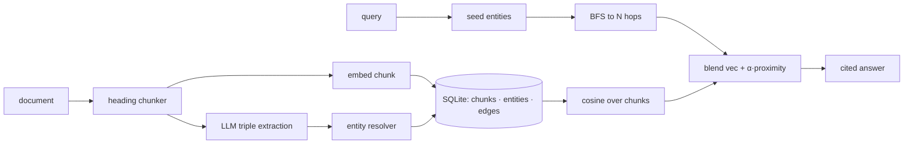

# rag-graph — knowledge-graph-augmented RAG for questions that connect facts

[](https://github.com/darrshangovender/rag-graph/actions/workflows/tests.yml)
[](LICENSE)
[](https://python.org)
[](https://sqlite.org)

> Documents go through LLM-based entity and relation extraction; the resulting triples live in a SQLite knowledge graph alongside chunk embeddings. At query time, retrieval blends vector kNN over chunks with multi-hop graph traversal from the entities named in the question.

**Why this exists.** Vector-only RAG is strong on "what does this document say about X" and weak on questions that need to *connect* facts across documents — "who funded the company that acquired Y?". A graph handles connection-shaped questions; vectors handle narrative and soft knowledge that never reduces to a triple. This is a small, readable implementation of doing both in one store, with the seams left visible.

Pairs with [rag-eval-harness](https://github.com/darrshangovender/rag-eval-harness) — `GraphRAG` satisfies its two-function pipeline contract.

---

## Quick start

```bash
pip install -e ".[openai,dev]"     # or ".[anthropic,dev]"
python examples/demo.py
```

```python
from rag_graph import GraphRAG
from rag_graph.embeddings import HashEmbedder   # OpenAIEmbedder() for real use

rag = GraphRAG(
    db_path="kg.db",
    embedder=HashEmbedder(dimension=16),
    extractor_model="claude-sonnet-4-5",        # provider inferred from the prefix
    answer_model="claude-sonnet-4-5",
)

rag.ingest(doc_id="doc-1", text="# DeepMind\nGoogle acquired DeepMind in 2014.")

result = rag.ask("Who founded the company Google acquired?", k=6, hops=2)
print(result.answer)
print(result.entities_used)     # canonical names the traversal touched
for s in result.sources:
    print(s["chunk_id"], s["vec_score"], s["graph_proximity"], s["final_score"])
```

All `GraphRAG` constructor arguments are keyword-only. Passing no embedder instantiates `OpenAIEmbedder`, which needs the `openai` extra installed.

## How it works



1. **Chunk** the document on its heading tree, keeping a breadcrumb path.
2. **Embed** each chunk and insert it.
3. **Extract** entities and triples from the same chunk with an LLM in strict-JSON mode, validated by Pydantic.
4. **Resolve** each entity through an alias index and upsert it; link chunk to entity.
5. **Edge** every triple whose subject and object both resolved, carrying an evidence quote.
6. **Seed** the query's entities by surface match, with an LLM fallback.
7. **Traverse** to `hops` depth, assigning each visited entity `1 / (1 + hop_distance)`.
8. **Blend** `vec_score + alpha * graph_proximity`, take top-k, and send those chunks to the model.

## The modules

| Module | Role |
|---|---|
| `chunker.py` | Heading-level split with breadcrumb sections; oversized paragraphs split on character budget |
| `extractor.py` | LLM → strict JSON → Pydantic `Extraction{entities, triples}`; 8 entity types |
| `resolver.py` | Surface normalisation (lower, depunctuate, sort tokens) plus an alias index |
| `store.py` | SQLite `chunks` / `entities` / `edges` / `chunk_entities`; embeddings as JSON text |
| `retriever.py` | Seed → BFS proximity → cosine scan → blended top-k |
| `embeddings.py` | `Embedder` protocol; `OpenAIEmbedder` (1536-d) and a deterministic `HashEmbedder` for tests |
| `core.py` | `GraphRAG.ingest` / `.ask`, context formatting, provider dispatch |

## Design decisions

| Decision | Why |
|---|---|
| **Hybrid, not pure graph** | A graph only knows what got extracted as a triple. Vectors catch the fuzzy, narrative knowledge that never reduces to (entity, predicate, entity) — and most real corpora are mostly that. |
| **Triples carry an evidence quote** | An edge you cannot trace back to a sentence is an assertion, not a fact. The quote is what makes the graph auditable when the extractor gets creative. |
| **Pydantic-validated extraction** | JSON mode still returns malformed output. Validating at the boundary means a bad extraction is a caught error rather than a corrupt node. |
| **SQLite with embeddings as text** | One file, zero infra, readable with any sqlite client while you are debugging why a traversal went wrong. The `GraphStore` surface is small enough that a pgvector swap is contained. |
| **Alias merging over exact strings** | Most naive graph-RAG implementations end up with "OpenAI" and "Open AI" as separate nodes, which silently halves every traversal. |

## Limitations

Read this section before using the library. Several of these are load-bearing.

- **The entity resolver is in-memory only and is never rehydrated from SQLite.** It starts at id 1 on every process. Ingesting into an *existing* `kg.db` therefore reissues ids that already belong to other entities, and `upsert_entity` overwrites them — while their old edges still point at the hijacked ids. **Incremental ingest across process restarts corrupts the graph silently.** Build the graph in one process, or rebuild from scratch.
- **Consequently the graph half of retrieval is dead in a fresh process.** The retriever's surface index is built from the resolver's in-memory state, so opening an existing DB without re-ingesting yields no seed entities, no traversal, and `graph_proximity = 0` everywhere. The system degrades to plain vector search with no warning.
- **The retrieved sub-graph is never sent to the model.** The context block contains only chunk text. The graph reweights *which chunks* are selected; the model never sees a triple, a predicate, or an evidence quote.
- **Cross-chunk relations are impossible by construction.** A triple is dropped unless both its subject and object appear in the same chunk's entity list — which is exactly the multi-document connection case the library exists for. Widening this is the highest-value change available.
- **Every query is O(N·D) in pure Python.** Retrieval JSON-decodes every stored embedding and runs a hand-rolled cosine in interpreter loops. At 1536 dimensions this is fine for a demo and unusable past a few thousand chunks. No numpy, no ANN, no caching — and a fresh retriever is constructed on every `ask()`.
- **BFS is unbounded.** No visited-node cap, no degree cap, no time budget, and one chunk lookup per visited entity. A hub entity fans out to the whole graph.
- **The score blend is unnormalised.** `vec + alpha * graph` adds a cosine in [-1, 1] to a proximity in (0, 1]. `alpha` is a `HybridRetriever` default that `GraphRAG.ask()` does not expose, so tuning it means bypassing `GraphRAG`.
- **Token-sorting normalisation causes false merges.** "AI Bias" and "Bias AI" collapse to one node.
- **Extraction failures are swallowed.** A bare `except Exception` around the extractor makes an API outage indistinguishable from a chunk that genuinely had no entities.
- **No citation verification.** The answer is the raw model string; nothing checks the `[cN]` markers exist or are in range.
- **No benchmark.** There is no eval, no results file, and this README makes no performance claims — because there is nothing here to back one up.

## Project layout

```
rag-graph/
├── rag_graph/
│   ├── core.py          # GraphRAG: ingest · ask
│   ├── chunker.py       # heading-aware splitter
│   ├── extractor.py     # LLM entity + relation extraction (Pydantic-validated)
│   ├── resolver.py      # surface normalisation + alias merging
│   ├── store.py         # SQLite chunks · entities · edges · joins
│   ├── retriever.py     # hybrid vector kNN + graph BFS
│   └── embeddings.py    # Embedder protocol · OpenAI · deterministic hash
├── examples/demo.py     # connection-style question end to end
└── tests/               # 9 tests, offline
```

## Tests

```bash
pytest tests/ -q       # 9 tests, no API keys
```

Honest coverage note: the suite exercises the chunker, the resolver, the store round-trip and embedder determinism. It does **not** exercise `HybridRetriever.retrieve`, the BFS, or the score blend — the three places the limitations above actually live. CI runs it on 3.11 and 3.12.

## Author

Darrshan Govender · [Agulhas Code](https://agulhascode.co.za) · Durban, South Africa
